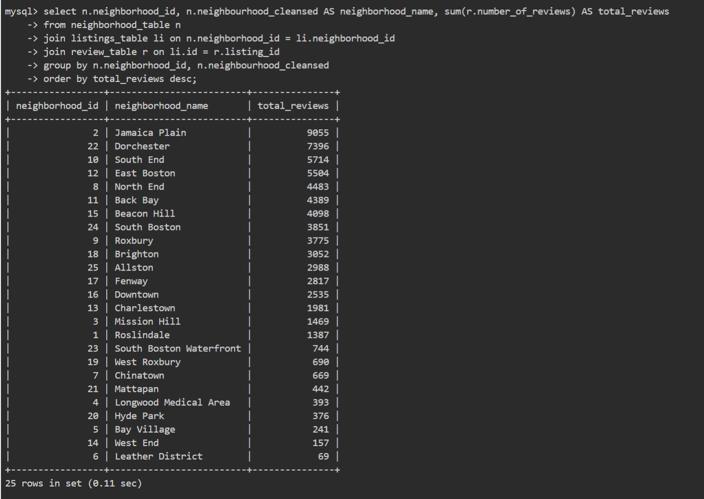
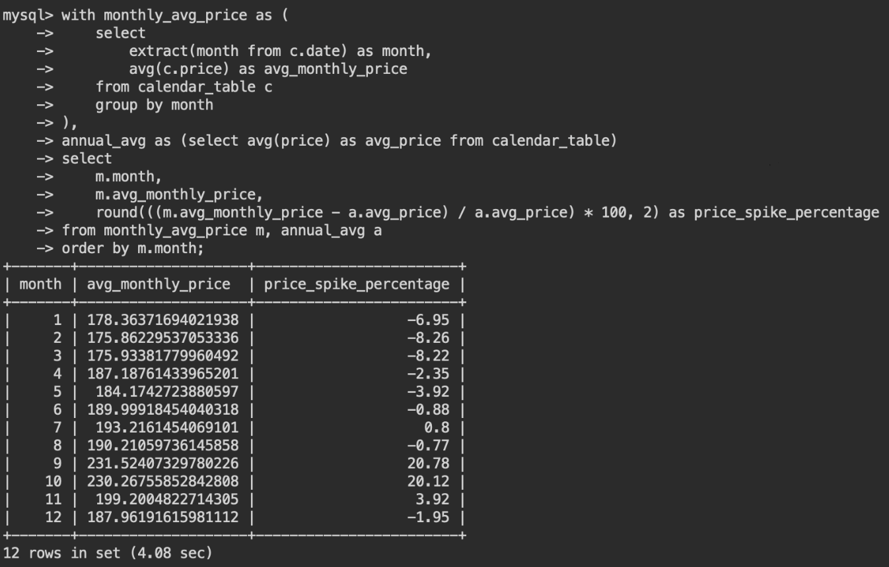

# Boston Airbnb Data Analysis

[toc]

## Research Problem

### Insight

1. What are the busiest times of the year to visit Boston? To what extent do prices spike?

2. What is the supply and demand situation in each neighborhood? Which neighborhoods are the most popular, and which ones show potential for growth?

   **Most popular**:  *Jamaica Plain* and *South End* 

   **Business Potential**: *Dochester* and *East Boston*

3. What are the top hosts? 

   **Most Listings**:

   - *Kara* (1,088), *Seamless* (711), *Mike* (488), and *Flatbook* (464) dominate in terms of listing count, reflecting their active presence on the platform.

   **Earn Most**:

   - *Seamless* leads with **$1.5 million** in estimated earnings, followed by *Jason* (**$1.3 million**) and *Mike* (**$881,856**), showcasing their revenue-driving potential.

   **Highest Ratings**:

   - Hosts with perfect average ratings (100%) include *Shahid*, *Andrew*, *Kelly*, and others, reflecting exceptional service quality and guest satisfaction.

   

### Detailed research problem: 

1. What are the busiest times of the year to visit Boston? To what extent do prices spike? (HXY)
   1. The time when the calendar price increases.
   2. How much do the calendar price increases	`
2. What are the top hosts? (JZY)
   1. Most Listings
   2. Earn most
   3. Rate Highest
3. What is the supply and demand situation in each neighborhood? Which neighborhoods are the most popular, and which ones show potential for growth? (JZY)
   1. Neighborhoods has the most number of review
   2. Neighborhoods has the most listings

## Top Hosts

### Most Listing

```sql
select h.host_id, h.host_name, count(l.id) as total_listings
from host_table h
join listings_table l on h.host_id = l.host_id
group by h.host_id, h.host_name
order by total_listings desc
limit 10;
```


### Earn Most

First, delete the "$" and turn it into float. 

```sql
update listings_table
set price = cast(replace(price, '$', '') as decimal(10, 2))
where price is not null;

alter table listings_table 
modify price float;
```

Then, we estimate the historical earnings using number of reviews.

```sql
select h.host_id, h.host_name, sum(l.price * r.number_of_reviews) as total_earnings
from host_table h
join listings_table l on h.host_id = l.host_id
join availability_table a on l.id = a.listing_id
join review_table r on l.id = r.listing_id
group by h.host_id, h.host_name
order by total_earnings desc
limit 10;
```


### Rate Highest

```sql
select h.host_id, h.host_name, avg(r.review_scores_rating) as avg_rating
from host_table h
join listings_table l on h.host_id = l.host_id
join review_table r on l.id = r.listing_id
where r.review_scores_rating is not null
group by h.host_id, h.host_name
order by avg_rating desc
limit 10;
```


### Average Statistics

```sql
select avg(total_listings) as avg_host_listings
from (
    select h.host_id, count(l.id) as total_listings
    from host_table h
    join listings_table l on h.host_id = l.host_id
    group by h.host_id
) subquery;
```


```sql
select avg(total_earnings) as avg_host_earnings
from (
    select h.host_id, sum(l.price * r.number_of_reviews) as total_earnings
    from host_table h
    join listings_table l on h.host_id = l.host_id
    join availability_table a on l.id = a.listing_id
    join review_table r on l.id = r.listing_id
    group by h.host_id
) subquery;
```


```sql
select avg(avg_rating) as avg_host_rating
from (
    select h.host_id, avg(r.review_scores_rating) as avg_rating
    from host_table h
    join listings_table l on h.host_id = l.host_id
    join review_table r on l.id = r.listing_id
    where r.review_scores_rating is not null
    group by h.host_id
) subquery;
```


### Key Observation

**1. Most Listings**

The first query identifies hosts with the highest number of total listings. The results show that:

- **Top Host: Kara** has the most listings at **1,088**.
- Other notable hosts include **Seamless (711)**, **Mike (488)**, and **Flatbook (464)**.

**2. Earn Most**

The third query introduces **number of reviews** as a factor in estimating earnings, revealing:

- **Seamless** is the top performer, with estimated earnings of **1.5 million**, followed by **Jason (1.3 million)** and **Mike (881,856)**.

**3. Highest Ratings**

The fourth query identifies hosts with the highest average ratings (100%). These hosts include **Shahid, Andrew, Kelly**, and several others with perfect scores.

## Neighborhood Supply and Demand

### Number of Reviews

```sql
select n.neighborhood_id, n.neighbourhood_cleansed AS neighborhood_name, sum(r.number_of_reviews) AS total_reviews
from neighborhood_table n
join listings_table li on n.neighborhood_id = li.neighborhood_id
join review_table r on li.id = r.listing_id
group by n.neighborhood_id, n.neighbourhood_cleansed
order by total_reviews desc;
```


### Number of Listings

```sql
select n.neighborhood_id, n.neighbourhood_cleansed AS neighborhood_name, count(li.id) AS total_listings
from neighborhood_table n
join listings_table li on n.neighborhood_id = li.neighborhood_id
group by n.neighborhood_id, n.neighbourhood_cleansed
order by total_listings desc;
```



### Key Observations

**Table 1: Total Reviews per Neighborhood**

- Top Neighborhoods by Total Reviews:
  - **Jamaica Plain**: 9055 reviews, indicating this is the most popular or active neighborhood in terms of visitor feedback.
  - **Dorchester**: 7396 reviews, suggesting high engagement or listing activity.
  - **South End**: 5714 reviews, also among the busiest neighborhoods.
- Bottom Neighborhoods:
  - **Leather District**: 69 reviews, indicating either low listing activity or visitor interest.
  - **Bay Village** and **Mattapan**: Both have low engagement, with 241 and 157 reviews respectively.

**Meaning/Insights**:

- The total reviews suggest **popularity** and **visitor activity** across neighborhoods. High-review neighborhoods are likely hotspots for tourism or rentals.
- Neighborhoods with low reviews could indicate underutilized opportunities or less attractive options for visitors.

**Table 2: Total Listings per Neighborhood**

- Top Neighborhoods by Total Listings:
  - **Jamaica Plain**: 343 listings, matching its high total reviews, indicating both popularity and abundant accommodations.
  - **South End** and **Back Bay**: 326 and 302 listings respectively, confirming their prominence in rental availability.
- Bottom Neighborhoods:
  - **Leather District**: 5 listings, which aligns with its low total reviews, suggesting very limited rental options.
  - **Longwood Medical Area** and **Mattapan**: Each has few listings.

**Meaning/Insights**:

- The total listings reflect **supply** in each neighborhood. More listings suggest areas with high property owner interest or demand for accommodations.
- Low-listing neighborhoods might represent areas with low property availability or lesser interest from hosts.

**Comparative Insights Between the Two Tables**:

- **High Reviews and High Listings**: Neighborhoods like *Jamaica Plain* and *South End* have both high review numbers and listing numbers, indicating both **high demand and supply**.
- **High Reviews but Lower Listings**: A neighborhood with relatively fewer listings but high review numbers like *Dochester* might indicate **business potentials**.
- **Low Reviews and Low Listings**: Neighborhoods like *Leather District* and *Longwood Medical Area* are less active, suggesting underutilization or limited demand.

## Busiest Times and Price Spikes

To assess how prices spike during the busiest periods, we'll calculate the average price per month and compare it to the annual average price.

```sql
with monthly_avg_price as (
    select 
        extract(month from c.date) as month,
        avg(c.price) as avg_monthly_price
    from calendar_table c
    group by month
),
annual_avg as (select avg(price) as avg_price from calendar_table)
select 
    m.month,
    m.avg_monthly_price,
    round(((m.avg_monthly_price - a.avg_price) / a.avg_price) * 100, 2) as price_spike_percentage
from monthly_avg_price m, annual_avg a
order by m.month;
```




### Key Observations

#### **1. Peak Months: September and October**

- **September (Month 9)** and **October (Month 10)** exhibit the highest average monthly prices at **$231.52** and **$230.27** respectively.
- **Price Spike Percentages** for these months are **+20.78%** and **+20.12%**, indicating a substantial increase compared to the annual average.
- **Implications:**
  - These significant price spikes suggest a **high demand** during these months, likely driven by factors such as favorable weather, fall foliage, academic calendars, and major events in Boston.
  - Hosts capitalize on this increased demand by raising prices, maximizing revenue during peak seasons.

#### **2. Off-Peak Months: January to March**

- **January (Month 1), February (Month 2), and March (Month 3)** show the lowest average monthly prices at **$178.36**, **$175.86**, and **$175.93** respectively.
- **Price Spike Percentages** for these months are **-6.95%**, **-8.26%**, and **-8.22%**, indicating a decrease relative to the annual average.
- **Implications:**
  - These months represent **off-peak periods** with lower demand, possibly due to colder weather, fewer tourists, and a post-holiday slowdown.
  - Lower prices incentivize travelers to book accommodations, providing opportunities for hosts to maintain occupancy rates despite reduced demand.


## Appendix

### All Queries

```sql
show databases;
show tables;

update calendar_table
set price = cast(replace(price, '$', '') as decimal(10, 2))
where price is not null;

alter table calendar_table 
modify price float;

update listings_table
set price = cast(replace(price, '$', '') as decimal(10, 2))
where price is not null;

alter table listings_table 
modify price float;

alter table listings_table
drop column availability,
drop column availability_2;


with monthly_avg_price as (
    select 
        extract(month from c.date) as month,
        avg(c.price) as avg_monthly_price
    from calendar_table c
    group by month
),
annual_avg as (select avg(price) as avg_price from calendar_table)
select 
    m.month,
    m.avg_monthly_price,
    round(((m.avg_monthly_price - a.avg_price) / a.avg_price) * 100, 2) as price_spike_percentage
from monthly_avg_price m, annual_avg a
order by m.month;
```

