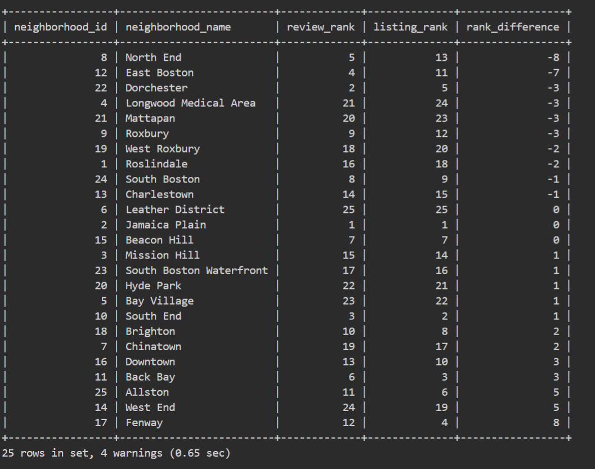

# Boston Airbnb Data Analysis - Answers

## 1. Busiest Times to Visit Boston and Price Spikes

### 1.1. What are the busiest times to visit Boston?

**Answer:**

The busiest times of the year to visit Boston are **September** and **October**. These months exhibit the highest average monthly prices, indicating increased demand for accommodations during these periods.

**Query:**
```sql
with monthly_avg_price as (
    select 
        extract(month from c.date) as month,
        avg(c.price) as avg_monthly_price
    from calendar_table c
    group by month
),
annual_avg as (select avg(price) as avg_price from calendar_table)
select 
    m.month,
    m.avg_monthly_price,
    round(((m.avg_monthly_price - a.avg_price) / a.avg_price) * 100, 2) as price_spike_percentage
from monthly_avg_price m, annual_avg a
order by m.month;
```


### 1.2. How much do the calendar prices increase?

**Answer:**

In **September** and in **October**, the represent price increases of **+20.78%** and **+20.12%** respectively compared to the annual average price.

**Query:**
```sql
with monthly_avg_price as (
    select 
        extract(month from c.date) as month,
        avg(c.price) as avg_monthly_price
    from calendar_table c
    group by month
),
annual_avg as (select avg(price) as avg_price from calendar_table)
select 
    m.month,
    m.avg_monthly_price,
    round(((m.avg_monthly_price - a.avg_price) / a.avg_price) * 100, 2) as price_spike_percentage
from monthly_avg_price m, annual_avg a
order by m.month;
```


### 1.3. What is the price gap between peak and off-peak months?

**Answer:**

There is a significant price gap between peak months (September and October) and off-peak months (January to March). While peak months see average prices exceeding **$230**, off-peak months have average prices around **$175-$178**, indicating a decrease of approximately **7-8%** below the annual average.

**Query:**
```sql
with monthly_avg_price as (
    select 
        extract(month from c.date) as month,
        avg(c.price) as avg_monthly_price
    from calendar_table c
    group by month
),
annual_avg as (select avg(price) as avg_price from calendar_table)
select 
    m.month,
    m.avg_monthly_price,
    round(((m.avg_monthly_price - a.avg_price) / a.avg_price) * 100, 2) as price_spike_percentage
from monthly_avg_price m, annual_avg a
order by m.month;
```


## 2. Top Hosts

### 2.1. Who owns the highest number of listings, and how many?

**Answer:**

The host with the highest number of listings is **Kara**, who owns **1,088** listings. Other top hosts include **Seamless** with **711** listings, **Mike** with **488** listings, and **Flatbook** with **464** listings.

**Query:**
```sql
select h.host_id, h.host_name, count(l.id) as total_listings
from host_table h
join listings_table l on h.host_id = l.host_id
group by h.host_id, h.host_name
order by total_listings desc
limit 10;
```


### 2.2. What is the average number of listings owned by a host?

**Answer:**

The average number of listings owned by a host is **3.4172**. This calculation is based on the total number of listings divided by the number of active hosts.

**Query:**
```sql
select avg(total_listings) as avg_host_listings
from (
    select h.host_id, count(l.id) as total_listings
    from host_table h
    join listings_table l on h.host_id = l.host_id
    group by h.host_id
) subquery;
```


### 2.3. Who earns the most, and how much do they earn?

**Answer:**

**Seamless** is the top-earning host with estimated earnings of **$1.5 million**. They are followed by **Jason** with **$1.3 million** and **Mike** with **$881,856** in estimated earnings.


**Query:**
First, delete the "$" and turn it into float. 

```sql
update listings_table
set price = cast(replace(price, '$', '') as decimal(10, 2))
where price is not null;

alter table listings_table 
modify price float;
```

Then, we estimate the historical earnings using number of reviews.

```sql
select h.host_id, h.host_name, sum(l.price * r.number_of_reviews) as total_earnings
from host_table h
join listings_table l on h.host_id = l.host_id
join availability_table a on l.id = a.listing_id
join review_table r on l.id = r.listing_id
group by h.host_id, h.host_name
order by total_earnings desc
limit 10;
```


### 2.4. What is the average earnings per host?

**Answer:**

The average earnings per host are **8161.55**. This figure is derived from the total estimated earnings of all hosts divided by the number of hosts.

**Query:**
```sql
select avg(total_earnings) as avg_host_earnings
from (
    select h.host_id, sum(l.price * r.number_of_reviews) as total_earnings
    from host_table h
    join listings_table l on h.host_id = l.host_id
    join availability_table a on l.id = a.listing_id
    join review_table r on l.id = r.listing_id
    group by h.host_id
) subquery;
```


### 2.5. Who has the highest rating, and what is their score?

**Answer:**

Several hosts have achieved the highest average rating of **100%**. These include **Shahid**, **Andrew**, **Kelly**, and others. This perfect rating reflects exceptional service quality and guest satisfaction.

**Query:**
```sql
select h.host_id, h.host_name, avg(r.review_scores_rating) as avg_rating
from host_table h
join listings_table l on h.host_id = l.host_id
join review_table r on l.id = r.listing_id
where r.review_scores_rating is not null
group by h.host_id, h.host_name
order by avg_rating desc
limit 10;
```


### 2.6. What is the average rating across all hosts?

**Answer:**

The average rating across all hosts is **93.28**. This statistic provides an overall view of guest satisfaction within the Boston Airbnb market.

**Query:**
```sql
select avg(avg_rating) as avg_host_rating
from (
    select h.host_id, avg(r.review_scores_rating) as avg_rating
    from host_table h
    join listings_table l on h.host_id = l.host_id
    join review_table r on l.id = r.listing_id
    where r.review_scores_rating is not null
    group by h.host_id
) subquery;
```


## 3. Supply and Demand in Each Neighborhood

### 3.1. Neighborhoods that have the most number of reviews

**Answer:**

The neighborhoods with the highest number of reviews are:
- **Jamaica Plain**: **9,055** reviews
- **Dorchester**: **7,396** reviews
- **South End**: **5,714** reviews

These figures indicate high visitor engagement and rental activity in these areas.

**Query:**
```sql
select n.neighborhood_id, n.neighbourhood_cleansed AS neighborhood_name, sum(r.number_of_reviews) AS total_reviews
from neighborhood_table n
join listings_table li on n.neighborhood_id = li.neighborhood_id
join review_table r on li.id = r.listing_id
group by n.neighborhood_id, n.neighbourhood_cleansed
order by total_reviews desc;
```


### 3.2. Neighborhoods that have the most listings

**Answer:**

The neighborhoods with the most listings are:
- **Jamaica Plain**: **343** listings
- **South End**: **326** listings
- **Back Bay**: **302** listings

A higher number of listings suggests strong supply and host interest in these popular neighborhoods.

**Query:**
```sql
select n.neighborhood_id, n.neighbourhood_cleansed AS neighborhood_name, count(li.id) AS total_listings
from neighborhood_table n
join listings_table li on n.neighborhood_id = li.neighborhood_id
group by n.neighborhood_id, n.neighbourhood_cleansed
order by total_listings desc;
```


**Rank Difference**

```python
select 
    tr.neighborhood_id,
    tr.neighborhood_name,
    tr.review_rank as review_rank,
    tl.listing_rank as listing_rank,
    tr.review_rank - tl.listing_rank as rank_difference
from (
    select 
        neighborhood_id,
        neighborhood_name,
        total_reviews,
        @review_rank := @review_rank + 1 as review_rank
    from (
        select 
            n.neighborhood_id, 
            n.neighbourhood_cleansed as neighborhood_name, 
            sum(r.number_of_reviews) as total_reviews
        from neighborhood_table n
        join listings_table li on n.neighborhood_id = li.neighborhood_id
        join review_table r on li.id = r.listing_id
        group by n.neighborhood_id, n.neighbourhood_cleansed
        order by total_reviews desc
    ) subquery, (select @review_rank := 0) r
) tr
join (
    select 
        neighborhood_id,
        neighborhood_name,
        total_listings,
        @listing_rank := @listing_rank + 1 as listing_rank
    from (
        select 
            n.neighborhood_id, 
            n.neighbourhood_cleansed as neighborhood_name, 
            count(li.id) as total_listings
        from neighborhood_table n
        join listings_table li on n.neighborhood_id = li.neighborhood_id
        group by n.neighborhood_id, n.neighbourhood_cleansed
        order by total_listings desc
    ) subquery, (select @listing_rank := 0) r
) tl
on tr.neighborhood_id = tl.neighborhood_id
order by rank_difference;
```



### 3.3. Average price per neighborhood

**Answer:**

Here is the list of neighborhoods with their respective average listing prices:
	1.	Bay Village: $266.83
	2.	South Boston Waterfront: $254.90
	3.	Leather District: $253.60
	4.	Back Bay: $236.81
	5.	Downtown: $236.46
	6.	Chinatown: $232.35
	7.	Beacon Hill: $211.15
	8.	West End: $209.59
	9.	South End: $200.37
	10.	Fenway: $197.49
	11.	North End: $195.67
	12.	Charlestown: $189.05
	13.	South Boston: $181.87
	14.	Jamaica Plain: $138.48
	15.	Longwood Medical Area: $138.44
	16.	Roxbury: $136.61
	17.	Mission Hill: $121.97
	18.	East Boston: $119.15
	19.	Brighton: $118.76
	20.	Allston: $112.31
	21.	West Roxbury: $107.11
	22.	Roslindale: $98.43
	23.	Dorchester: $91.63
	24.	Hyde Park: $86.54
	25.	Mattapan: $75.12

These averages are helpful in understanding the market positioning and affordability of accommodations in each neighborhood.

**Query:**
```sql
select 
    n.neighborhood_id, 
    n.neighbourhood_cleansed AS neighborhood_name, 
    avg(l.price) AS average_price
from 
    neighborhood_table n
join 
    listings_table l 
    on n.neighborhood_id = l.neighborhood_id
group by 
    n.neighborhood_id, 
    n.neighbourhood_cleansed
order by 
    average_price desc;
```


